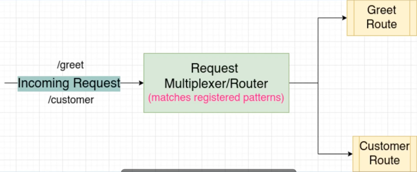
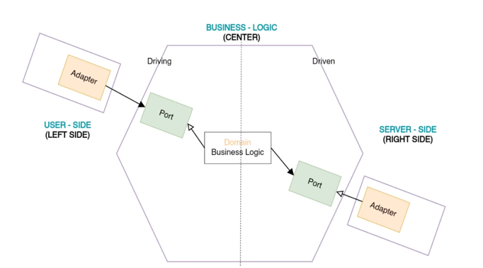
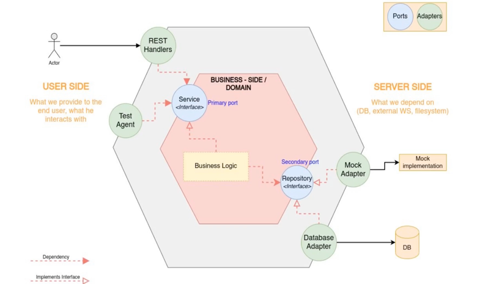

Objective this project
============================
## 1. Mechanism of HTTP web server
## 2. Handler functions and request multiplexer(Router)
## 3. Request and Response Headers
## 4. Marshalling and Unmarshalling data structures to JSON and XML representations

Multiplexer

Hexagonal Architecture

- The hexagonal architecture, or ports and adapters architecture, is an architectural pattern used in software design. It aims at creating loosely coupled application components that can be easily connected to their software environment by means of ports and adapters. This makes components exchangeable at any level and facilitates test automation.
- The first principle is to explicitly separate the code into three large areas.
  - The user side or the left side, is responsible for driving the application.
  - The Business side, here we want to isolate from both the left and the right side. It contains all the code that concerns the business logic.
  - The right side or server side, contains the essential infrastructure code that interacts with our database.
- The second principle is that the dependencies go inside the rule here.
- The third principle is that the boundaries are isolated with interfaces.

